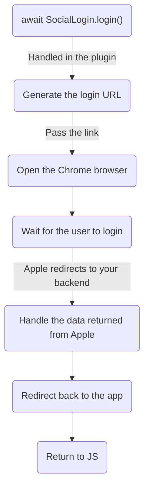
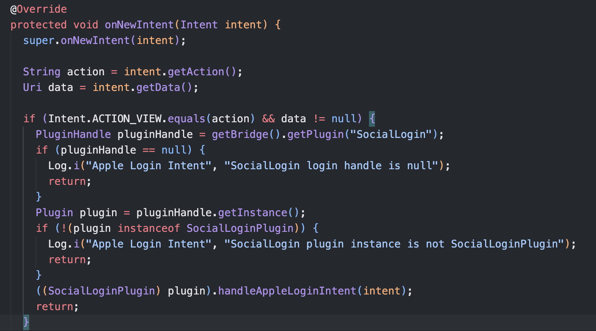

# Capgo Social Login "Apple login" guide

### Introduction

In this guide, you are going to learn how to configure Apple Login with Capacitor.
Requirements:

- Apple Developer Account
- A computer running macOS (IOS only)
- Xcode installed (IOS only)
- A custom backend (Android only)

### Apple login on IOS

Let's break down what you are going to need in order to setup Apple login on IOS.

Firstly, you need to configure the capabilities of your app. In order to do this, please open Xcode, click on `App`


Now, you want to make sure that you sellect the right target.


Then, please make sure that you add the `Sign in with Apple` capability.


Next, you want to initialize the Apple Login.

| NOTE: I am using Vue as my framework, the exact implementation will vary depening on the framework of your choice |
| ----------------------------------------------------------------------------------------------------------------- |

```ts

//  onMounted is vue specific
onMounted(() => {
  SocialLogin.initialize({
    apple: {}
  })
});
```

Later, you want to create a button that will begin the login process.

```ts
async function loginApple() {
  const res = await SocialLogin.login({
    provider: 'apple',
    options: {}
  })
  // token = the JWT returned by Apple
  const token = res.result.idToken
  // Send the token to your backend.... 
}
```

Then, you want to run your app on a **<u>PHYSICAL</u>** device and test it. If you followed the steps closely you will see the following screen after clicking your button.


### Apple login on Android

Apple login on android is hacky. Apple has no official support for `Sign in with Apple` on Android, so the solution is slightly hacky.

Android currently uses a chrome tabs to display an OAuth2 website. This approach has the challanges:

- Difficult configuration

- A backend is required

#### Understanding the login with Apple flow on android.

Let me use a diagram to explain the flow on android:



Now that you are aware of the challlanges and the flow, let's begin the configuration.

Let's login into the [Apple Developer Portal](https://developer.apple.com). Now, click on `Identifiers`.


You should see a screen that looks like this:


1) Ensure that this field says `App IDs`

2) Make sure that you can find your App ID. If you don't have configured Apple Login for IOS, you will have to create one. For me, I already have one created. The app ID I will use is `me.wcaleniewolny.test.ionic.vue`
   
   - If you don't already have an App ID, click on the plus button
   
   - Select `App IDs` and click continue 
   
   - Click on type `App` and click `Continue` 
   
   - Enter the description and the app ID 
   
   - Enable `Sign with Apple` capability 
   
   - Click `Continue` 
   
   - Confirm the details and click `Register` 

3) Make sure that the `Sign in with Apple` capability is enabled for your app
   
   - Click on your app
     
   
   - Ensure that the `Sign in with Apple` capability is enabled
     
     If it isn't enabled, enable it.

4) Go back to all `All Identifiers` 
5. Click on `App Ids` and go to `Services IDs`
   

6. Creare a new identifier
   
   - Click on the plus button
     
   
   - Select `Servcice IDs` and click `Continue`
     
   
   - Enter a description and a identifiers and click `Continuie`. **WARNING**: This `identifiers` will become the `clientId` that you will pass in the `initialize` function AND `ANDROID_SERVICE_ID` for the backend. **Please save it!!!**
     
     Service ID doesn't have to match the App ID, but I recomend setting the service ID to `YOUR_APP_ID.serivce` . As a reminder, I am using `me.wcaleniewolny.test.ionic.vue` for my app ID but I am using `ee.forgr.io.ionic.service2` as the service ID.
   
   - Please verify the details and click `Register`
     
   
   - Click on the the newly created service
     
   
   - Enable the `Sign in with Apple` option
     
   
   - Configure the `Sign In with Apple`
     
   
   - Ensure that the `Primary App ID` is set to the App ID configured in the previous step
     
   
   - Add the domain that you are going to host you backend on. Furthermore, this backend HAS to be running on HTTPS. As for the `Return URLs`, you might want to come back to this after reading the next section of this tutorial and after configuring the backend. For the purposes of this tutorial, I will use `https://xyz.wcaleniewolny.me/login/callback` for the return URL and `xyz.wcaleniewolny.me` the doman. Press next.
     
- Confirm the data and click `Done`
  

- Click on `Continue`
  

- Click on `Save`
  
7. Now, you have to generate a key. This key will be used on the backend.
- Click on `Keys`
  

- Click on the plus icon
  

- Name your key, this name isn't important
  

- Select `Sign in with Apple` and click `Configure`
  

- Select the primary App ID, this must be the same App ID as in the previous steps. Press `Save`
  

- Click on `Continue`
  

- Click on `Register`
  

- Copy tke key ID. **IMPORTANT:** Save this ID, in the backend it will become called `KEY_ID`. Download the key
  

- This will download the key. Please save it in a safe place, you will need it in the backend
  
8. Get the `Team ID`
   
   - Go to [this website](https://developer.apple.com/account) and scroll down
   
   - Find the `Team ID`
     

#### Configuring the app redirect

As you saw in the diagram, the backend performs a step called `Redirect back to the app`. This requires manual changes to your app.

1. First, you need to modify the `AndroidManifest.xml`.
   
   - Open the file, I will use `AndroidStuido`
     
   
   - Find the `MainActivity` and add the following Intent filter
     
     
     ```xml
     <intent-filter>
         <action android:name="android.intent.action.VIEW" />
         <category android:name="android.intent.category.DEFAULT" />
         <category android:name="android.intent.category.BROWSABLE" />
         <data android:scheme="capgo-demo-app" android:host="path" />
     </intent-filter>
     ```
     
     You have just added a new deep link into your app. The deep link will look something like this: `capgo-demo-app://path`. You can change the `android:scheme` and the `android:host` to modify how this deep link looks.
     **Important:** In the backend configuration, this deep link will become `BASE_REDIRECT_URL`

2- Now, you need to modify the `MainActivity` file

- Please open the `MainActivity`
  

- After you open this file, you will want to add the following code:
  
  
  ```java
  @Override
  protected void onNewIntent(Intent intent) {
      String action = intent.getAction();
      Uri data = intent.getData();
  
      if (Intent.ACTION_VIEW.equals(action) && data != null) {
          PluginHandle pluginHandle = getBridge().getPlugin("SocialLogin");
          if (pluginHandle == null) {
              Log.i("Apple Login Intent", "SocialLogin login handle is null");
              return;
          }
          Plugin plugin = pluginHandle.getInstance();
          if (!(plugin instanceof SocialLoginPlugin)) {
              Log.i("Apple Login Intent", "SocialLogin plugin instance is not SocialLoginPlugin");
              return;
          }
          ((SocialLoginPlugin) plugin).handleAppleLoginIntent(intent);
          return;
      }
      super.onNewIntent(intent);
  }
  ```
  
  This example assumes that you don't have any deep links configured. If you do, please adjust the code

#### Backend configuration

A backend is required for Android, but configuring a backend will also impact IOS. An example backend is provided [here](https://github.com/WcaleNieWolny/capgo-social-login-backend-demo/blob/main/index.ts)

This example provides the following:

- A simple JSON database

- A way to request the JWT from Apple's servers

- A simple JWT verification

I use `PM2` in order to host this example. A example `ecosystem.config.js` can be found [here](https://github.com/WcaleNieWolny/capgo-social-login-backend-demo/blob/main/ecosystem.config.js.example)

Given everything that I said in this tutorial, here is how the `env` section would look:

ANDROID_SERVICE_ID = Service ID
IOS_SERVICE_ID = App ID

```js
env: {
  PRIVATE_KEY_FILE: "AuthKey_U93M8LBQK3.p8",
  KEY_ID: "U93M8LBQK3",
  TEAM_ID: "UVTJ336J2D",
  ANDROID_SERVICE_ID: "ee.forgr.io.ionic.starter.service2",
  IOS_SERVICE_ID: "me.wcaleniewolny.test.ionic.vue",
  PORT: 3000,
  REDIRECT_URI: "https://xyz.wcaleniewolny.me/login/callback",
  BASE_REDIRECT_URL: "capgo-demo-app://path"
}
```

#### Using the plugin

The usage of the `login` function doesn't change, it's the same as IOS. Please take a look at that section for more info. **HOWEVER**, the `initialize` method changes a bit.

```typescript
await SocialLogin.initialize({
  apple: {
    clientId: 'ee.forgr.io.ionic.starter.service2',
    redirectUrl: 'https://appleloginvps.wcaleniewolny.me/login/callback'
  }
})
```

Note, that adding `redirectUrl` **WILL** affect IOS!!!
