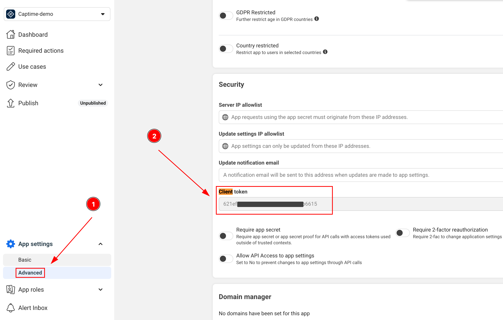
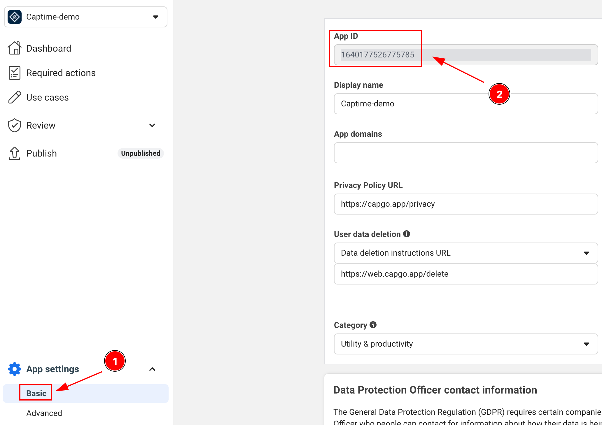
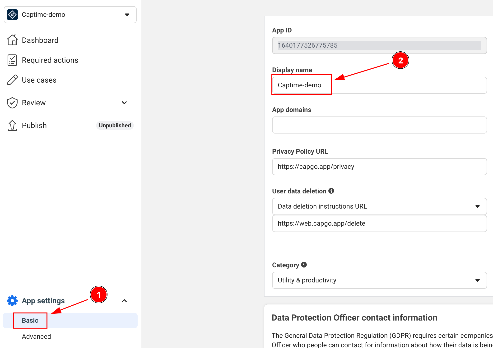

# Capgo Social Login "Facebook login" guide

### Introduction

In this guide, you will learn how to setup Facebook Login with Capgo Social Login. You will need the following:

- A Facebook Developer Account
- Your app's package name/bundle ID
- Access to a terminal for generating key hashes (Android)

### General Setup

If you don't already have a Facebook app created, follow this tutorial to create one:

1. Follow the tutorial to [Create an App](https://developers.facebook.com/docs/development/create-an-app/)

2. Before you can release your app to the public, please follow th  is [tutorial](https://developers.facebook.com/docs/development/release) to publish it. 

### Where to find important information

1. CLIENT_TOKEN:
  - You can find the client token here:  
  

2. APP_ID:
  - You can find the app id here:  
  

3. APP_NAME:
  - You can find the app name here:  
  

### Android Setup

1. First, ensure you have the internet permission in your `AndroidManifest.xml`. Open the file and verify this line is present:

```xml
<uses-permission android:name="android.permission.INTERNET"/>
```

2. Generate your Android key hash. This is a crucial security step required by Facebook. Open your terminal and run:

```bash
keytool -exportcert -alias androiddebugkey -keystore ~/.android/debug.keystore | openssl base64 -A
```

When prompted for a password, use: `android`

For release builds, you'll need to use your release keystore:

```bash
keytool -exportcert -alias your-key-name -keystore your-keystore-path | openssl base64 -A
```

3. Add the key hash to your Facebook app:
   - Go to your app's dashboard on Facebook Developers
   - Navigate to Settings > Basic
   - Scroll down to "Android" section
   - Click "Add Platform" if Android isn't added yet and fill in the details
   - Add the key hash you generated
   - For production, add both debug and release key hashes

4. Update your `AndroidManifest.xml` to include:

```xml
<application>
    ...
    <activity android:name="com.facebook.FacebookActivity"
        android:configChanges="keyboard|keyboardHidden|screenLayout|screenSize|orientation"
        android:label="@string/app_name" />
    
    <activity
        android:name="com.facebook.CustomTabActivity"
        android:exported="true">
        <intent-filter>
            <action android:name="android.intent.action.VIEW" />
            <category android:name="android.intent.category.DEFAULT" />
            <category android:name="android.intent.category.BROWSABLE" />
            <data android:scheme="@string/fb_login_protocol_scheme" />
        </intent-filter>
    </activity>
</application>
```

### iOS Setup

1. Add the iOS platform if you haven't already:
  - Go to your app's dashboard on Facebook Developers
  - Navigate to Settings > Basic
  - Scroll down to very bottom of the page and click "Add Platform"
  - Click "Add Platform" if iOS isn't added yet and fill in the details

2. Open your Xcode project and navigate to Info.plist

3. Add the following entries to your Info.plist:

```xml
<key>FacebookAppID</key>
<string>[APP-ID]</string>
<key>FacebookClientToken</key>
<string>[CLIENT-TOKEN]</string>
<key>FacebookDisplayName</key>
<string>[APP-NAME]</string>
<key>LSApplicationQueriesSchemes</key>
<array>
    <string>fbapi</string>
    <string>fb-messenger-share-api</string>
</array>
<key>CFBundleURLTypes</key>
<array>
    <dict>
        <key>CFBundleURLSchemes</key>
        <array>
            <string>fb[APP-ID]</string>
        </array>
    </dict>
</array>
```

Replace:
- `[APP-ID]` with your Facebook app ID
- `[CLIENT-TOKEN]` with your client token
- `[APP-NAME]` with your app's name

### Using Facebook Login in Your App

1. Initialize the Facebook login in your app:

```typescript
import { SocialLogin } from '@capgo/capacitor-social-login';

// Initialize during app startup
await SocialLogin.initialize({
  facebook: {
    appId: 'APP_ID',
    clientToken: 'CLIENT_TOKEN',
  }
})
```

2. Implement the login:

```typescript
async function loginWithFacebook() {
  try {
    const result = await SocialLogin.login({
      provider: 'facebook',
      options: {
        permissions: ['email', 'public_profile'],
        limitedLogin: false // this will depend if you want to use the limited login or not. Docs: https://developers.facebook.com/docs/facebook-login/limited-login
      }
    });
    console.log('Facebook login result:', result);
    // Handle successful login
  } catch (error) {
    console.error('Facebook login error:', error);
    // Handle error
  }
}
```

### Troubleshooting

1. If you get key hash errors on Android:
   - Double check that you've added the correct key hash to the Facebook dashboard
   - For release builds, make sure you've added both debug and release key hashes
   - Verify you're using the correct keystore when generating the hash

2. If the Facebook login button doesn't appear:
   - Verify all manifest entries are correct
   - Check that your Facebook App ID and Client Token are correct
   - Ensure you've properly initialized the SDK

3. Common iOS issues:
   - Make sure all Info.plist entries are correct
   - Verify URL schemes are properly configured
   - Check that your bundle ID matches what's registered in the Facebook dashboard

### Testing

1. Before testing, add test users in the Facebook Developer Console:
   - Go to Roles > Test Users
   - Create a test user
   - Use these credentials for testing

2. Test both debug and release builds:
   - Debug build with debug key hash
   - Release build with release key hash
   - Test on both emulator and physical devices

Remember to test the full login flow, including:
- Successful login
- Login cancellation
- Error handling
- Logout functionality
