# Capgo Social Login "Google login" guide

### Introduction

In this guide, you will learn how to setup Google Login with Capgo Social Login. You will need the following in order to setup Google Login:

- A Google account

### General setup

This step is required regardless of which the platform you decide to use. In this part, you will setup the login screen displayed by Google. 

1. Please go to [console.cloud.google.com](https://console.cloud.google.com/)

2. If you don't have a project already, please **create a new project**.
   
   - Click on the project selector
     
   
   - Click `New project`
     
   
   - Name your project and click `Create`
     
   
   - Ensure that you are on the right project
     

3. Configure the  `OAuth consent screen`
   
   - Click on the search bar
     
   
   - Search for `OAuth consent screen` and click on it
     
   
   - Configure the consent screen. I will assume that you are developing an app open to the public, so I will use the  `external`  user type. Please select the user type that suits you the best AND click `create`
     
   
   - Now, you have a lot of informations to fill
     
     - Let's start with the `App Information`
       
       Please type in your `App Name`. **WARNING: THIS WILL BE DISPLAYED TO THE USERS**
       
       Next, please enter the User support email. You can learn more about the support email [here](https://support.google.com/cloud/answer/10311615#user-support-email&zippy=%2Cuser-support-email)
     
     - Then, you **CAN** add the app logo. This is not obligatory and I will skip this step
       
     
     - Then, you **SHOULD** configure the `App domain`. I will not do that because this is just a simple demonstration that will **NOT** get published, but I strongly recommend filling this section.
       
     
     - Later, you **HAVE TO** provide the developer's email.
       
   
   - Please click `save and continue`
     

4. Next, please configure the scopes
   
   - Click on `add or remove scopes` 
     
   
   - Select the following scopes and click `update`
     
   
   - Click `save and continue`
     

5. Now, you need to add a test user.
   
   - Click on `add users`
     
   
   - Enter your Google email, click enter, and click `add`
     
   
   - Click `save and continue`
     

6. Click `back to dashboard`
   

7. I strongly recommend submitting you app for verification. This is outside the scope of this tutorial. You can learn more [here](https://support.google.com/cloud/answer/13463073)

### Using Google login on IOS

In this part, you will learn how to setup Google login in IOS

1. Please create an IOS client ID in the google console
   
   - Click on the search bar
     
   
   - Search for `credentials` and click on the `APIs and Services` one (number 2 on the screenshot)
     
   
   - Click on the `create credentials`
     
   
   - Select `OAuth client ID`
     
   
   - Select the `Application type` to `IOS`
     
   
   - Now, you need to find the bundle ID
     
     - Please open Xcode
     
     - Double click on `App`
       
     
     - Ensure that you are on `Targets -> App`
       
     
     - Find your `Bundle Identifier` 
       
     
     - Go back to the Google Console and paste your `Bundle Identifier` into `Bundle ID`
       
   
   - Now, you can add your `App Store ID` or `Team ID` into the client ID. This isn't necessary, but if you have published your app to App Store I recommend filling those fields
   
   - Additionally, you can setup [Firebase App Check](https://developers.google.com/identity/sign-in/ios/appcheck). This is outside the scope of this tutorial
   
   - After filling all the details, please click `create`
     
   
   - You now want to click `ok`
   
   - Open the newly created IOS client
     
   
   - Copy the following data
     
     
     The `nr. 1` in this image will later become the `iOSClientId` in the `initialize` call
     The `nr. 2` in this image will later become `YOUR_DOT_REVERSED_IOS_CLIENT_ID`

2. Now, you need to modify your app's plist.
   
   - Please open Xcode and find the `Info` file
     
   
   - Now, you want to right click this file and open it as source code
     
   
   - At the bottom of your `Plist` file, you will see a `</dict>` tag.
     
   
   - You want to insert the following fragment just before it, just like this
     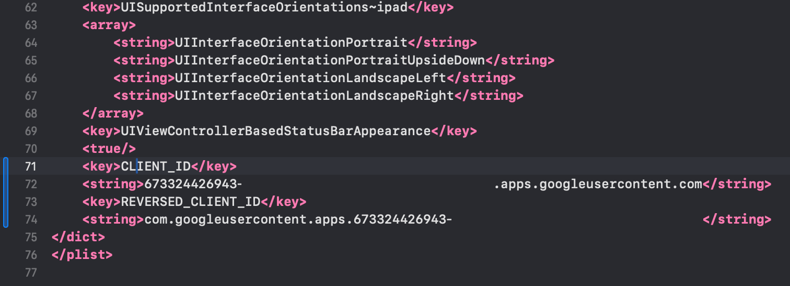
     
     ```xml
     <key>CFBundleURLTypes</key>
     <array>
      <dict>
        <key>CFBundleURLSchemes</key>
        <array>
          <string>YOUR_DOT_REVERSED_IOS_CLIENT_ID</string>
        </array>
      </dict>
     </array>
     ```
   
   - Now, you want to change the `YOUR_DOT_REVERSED_IOS_CLIENT_ID` to the value copied in the previous step
     
     You want it to look like this:
     
     
     **WARNING:** Ensure that this value **STARTS** with `com.googleusercontent.apps`
   
   - Save the file with `Command + S`

3. Modify the `AppDelegate`
   Although not strictly required, it's recommended by Google.
   
   - Open the AppDelegate
     
   
   - Insert `import GoogleSignIn` before the first line
     
   
   - Find the `func application(_ app: UIApplication, open url: URL, options: [UIApplication.OpenURLOptionsKey: Any] = [:])` function. It should look like this
     
   
   - Modify the function to look like this
     
     ```swift
     func application(_ app: UIApplication, open url: URL, options: [UIApplication.OpenURLOptionsKey: Any] = [:]) -> Bool {
         // Called when the app was launched with a url. Feel free to add additional processing here,
         // but if you want the App API to support tracking app url opens, make sure to keep this call
     
         var handled: Bool
     
         handled = GIDSignIn.sharedInstance.handle(url)
         if handled {
           return true
         }
     
         return ApplicationDelegateProxy.shared.application(app, open: url, options: options)
     }
     ```
     
     
   
   - Save the file with `Command + S`

4. Now, you should be ready to setup Google login in JS.
   
   - First, you need import `SocialLogin` AND `Capacitor`
     
     ```typescript
     import { SocialLogin } from '@capgo/capacitor-social-login';
     import { Capacitor } from '@capacitor/core';
     ```
   
   - Then, you want to call initialize. I recommend calling this ONLY once.
     
     ```ts
     // onMounted is Vue specific
     onMounted(() => {
       SocialLogin.initialize({
         google: {
           iOSClientId: '673324426943-redacted.apps.googleusercontent.com',
         }
       })
     })
     ```
     
     **WARNING:** Ensure that `iOSClientId` **ENDS** with `googleusercontent.com`
   
   - Later, you want to call `SocialLogin.login`. I recommend creating a button and running the following code on click.
     
     ```ts
     const res = await SocialLogin.login({
       provider: 'google',
       options: {}
     })
     // handle the response. popoutStore is specific to my app
     popoutStore.popout("Google login", JSON.stringify(response))
     ```

5. Next, you want to build your app and run `cap sync`. If you done everything correctly, you should see the following
   
   
   PS: Please pardon the polish language in the google prompt. I don't know how to change it.

### Using Google login on Android

In this part, you will learn how to setup Google login in Android

1. Please create an Android client ID. You can find the details where to create a client ID in the first point of the IOS section
   
   - Select the `Android` application type
     
   
   - Open Android Studio
   
   - At the very bottom of the navigator, find the `Gradle Scripts`
     
   
   - Find `build.gradle` for the module `app`
     
   
   - Copy the `android.defaultConfig.applicationId`. This will be your `package name` in the Google console
     
   
   - Now, open the terminal. Make sure that you are in the `android` folder of your app and run `./gradlew signInReport`
     
   
   - Before continuing, I **MUST** warn you. The Android SHA1 certificate is beyond painful and I wouldn't wish it on anyone to have to set this up. I will assume the simplest scenario of an app that isn't published to Google Play Store and that is only ever used on a local simulator. If, however, you have deployed your app to Google Play Store, you **MUST** use the SHA1 from Google Play console for production releases.
     Finally, it's important to mention that if you mess up, the error will NOT be obvious. It may be very difficult to debug. If you struggle with the setup, please look at the [Github issues](https://github.com/Cap-go/capacitor-social-login/issues).
   
   - Now, scroll to the top of this command. You should see the following. Copy the `SHA1`.
   
   - Now, go back to the Google Console. Enter your `applicationId` as the `Package Name` and your SHA1 in the certificate field and click `create`
     

2. Create a web client (this is required for Android)
   
   - Go to the "Create credentials" page in Google Console
   
   - Set application type to "Web"
     
   
   - Click "Create"
     
   
   - Copy the client ID, you'll use this as the `webClientId` in your JS/TS code
     

3. Now, you need to modify your `MainActivity`
   
   - Please open your app in Android Studio. You can run `cap open android`
   
   - Please find `MainActivity.java`
     
     - Open the `app` folder
       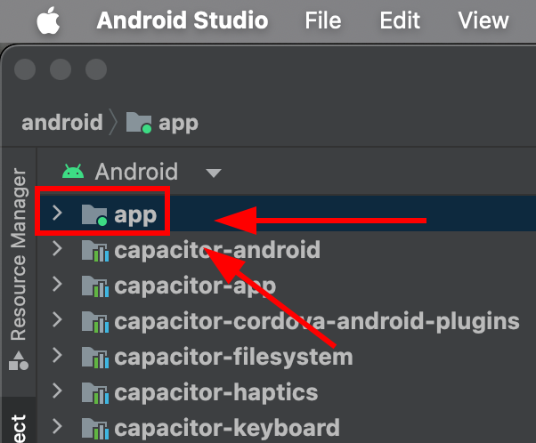
     
     - Find `java`
       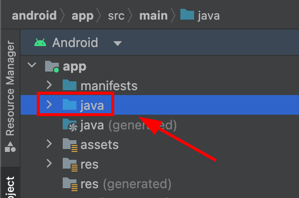
     
     - Find your `MainActivity.java` and click on it**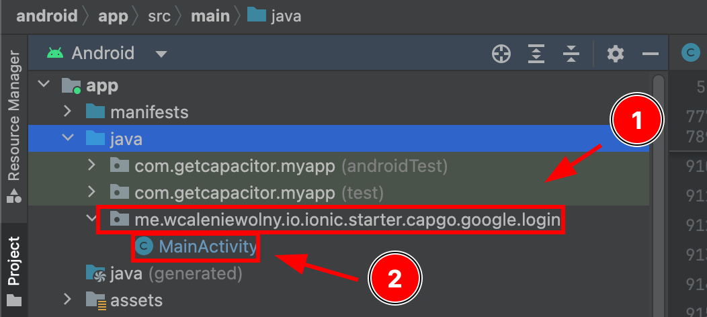
- Now, you have to modify `MainActivity.java`. Please add the following code
  
  ```java
  import ee.forgr.capacitor.social.login.GoogleProvider;
  import ee.forgr.capacitor.social.login.SocialLoginPlugin
  import ee.forgr.capacitor.social.login.ModifiedMainActivityForSocialLoginPlugin;
  import android.content.Intent;
  
  // ModifiedMainActivityForSocialLoginPlugin is VERY VERY important !!!!!!    
  public class MainActivity extends BridgeActivity implements ModifiedMainActivityForSocialLoginPlugin {}
  
        @Override
        public void onActivityResult(int requestCode, int resultCode, Intent data) {
          super.onActivityResult(requestCode, resultCode, data);
  
          if (requestCode >= GoogleProvider.REQUEST_AUTHORIZE_GOOGLE_MIN && requestCode < GoogleProvider.REQUEST_AUTHORIZE_GOOGLE_MAX) {
            PluginHandle pluginHandle = getBridge().getPlugin("SocialLogin");
            if (pluginHandle == null) {
              Log.i("Google Activity Result", "SocialLogin login handle is null");
              return;
            }
            Plugin plugin = pluginHandle.getInstance();
            if (!(plugin instanceof SocialLoginPlugin)) {
              Log.i("Google Activity Result", "SocialLogin plugin instance is not SocialLoginPlugin");
              return;
            }
            ((SocialLoginPlugin) plugin).handleGoogleLoginIntent(requestCode, data);
          }
        }
  
        // This function will never be called, leave it empty
        @Override
        public void IHaveModifiedTheMainActivityForTheUseWithSocialLoginPlugin() {}
  }
  ```

- Please save the file
4. Now, you SHOULD be ready to use the login. Here is how you use it from typescript.
   
   - First, you need import `SocialLogin`
     
     ```typescript
     import { ScialLogin } from '@capgo/capacitor-social-login';
     ```
   
   - Then, you want to call initialize. I recommend calling this ONLY once.
     
     ```ts
     // onMounted is Vue specific
     // webClientId is the client ID you got in the web client creation step not the android client ID.
     onMounted(() => {
     SocialLogin.initialize({
       google: {
         webClientId: '673324426943-avl4v9ubdas7a0u7igf7in03pdj1dkmg.apps.googleusercontent.com',
       }
     })
     })
     ```
     
     Later, you want to call `SocialLogin.login`. I recommend creating a button and running the following code on click.
     
     ```ts
     const res = await SocialLogin.login({
     provider: 'google',
     options: {}
     })
     // handle the response. popoutStore is specific to my app
     popoutStore.popout("Google login", JSON.stringify(response))
     ```

5. Before continuing, please ensure that you either use a physical device that supports Google Play Services or that you configure the emulator correctly. I will be using the emulator. Not every emulator will work with Google Login, so I will show you how to set one up
   
   - First, go into `Device manager` and click the plus button
     
   
   - Create a virtual device
     
   
   - Select any device with a `Play Store` icon
     
     
     As you can see, the `pixel 8` supports the `Play Store` services
   
   - Click `next`
     
   
   - Next, **MAKE SURE** that the OS image is of type `Google Play`. **IT MUST** be of type `Google Play`
     
   
   - Click next
     
   
   - Confirm your device. I will name my emulator `Tutorial phone`
     
   
   - Next, go into `Device Manager` and boot up your simulator
     
   
   - After the simulator boots up, please go into it's settings
     
   
   - Now, go into `Google Play`
     
   
   - Click `Update` and wait about 60 seconds
     

6- If you did everything correctly, you should see the following

   

### Using Google login on the web

Using the google login on the web is rather simple.
In order to use it, you have to do the following:

1. Create a web client in the Google Console.
   
  - Please follow step 2 of the `Using Google login on Android` if you have not configured it already
2. Configure the web client in the Google Console

  - Please open the [credentials page](https://console.cloud.google.com/apis/credentials) and click on your web client
    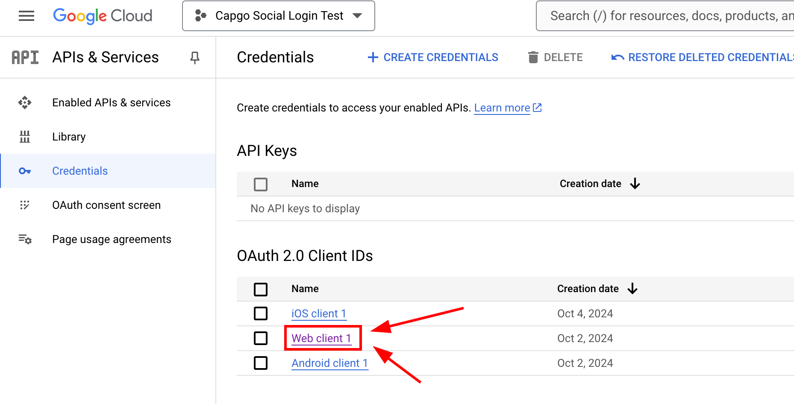

  - Now, please add the `Authorized JavaScript origins`. This should include all the addresses that you might use for your app. In might case, I will **ONLY** use localhost, but since I use a custom port I have to add both `http://localhost` and `http://localhost:5173`
    
    - Please click on `add URI`
      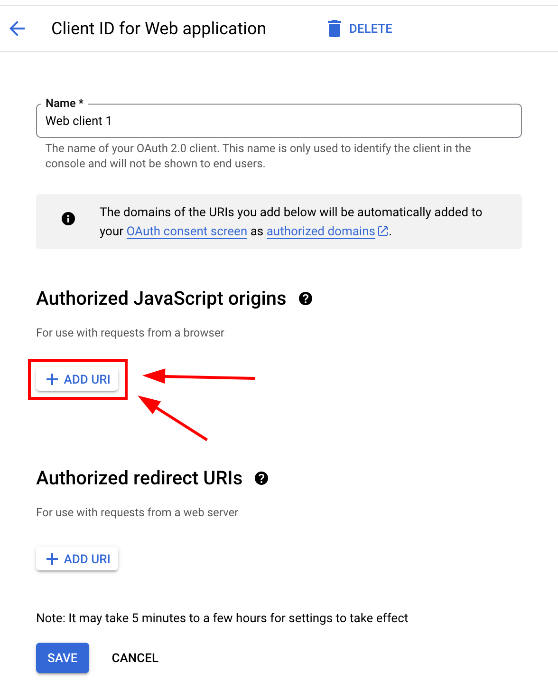
    
    - Please type your URL
      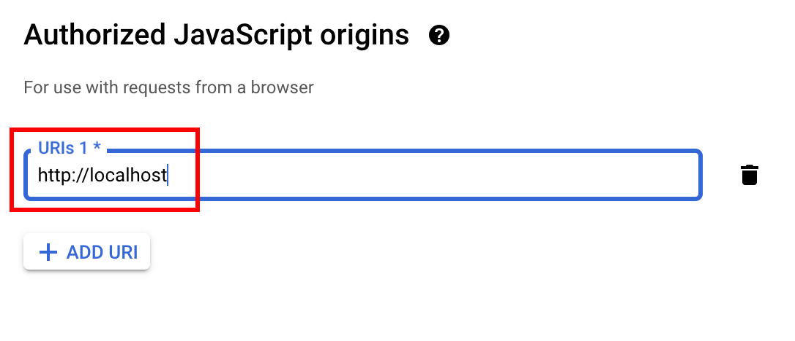
    
    - Please repeat until you added all the URLs
    
    - When you finish, your screen should look something like this
      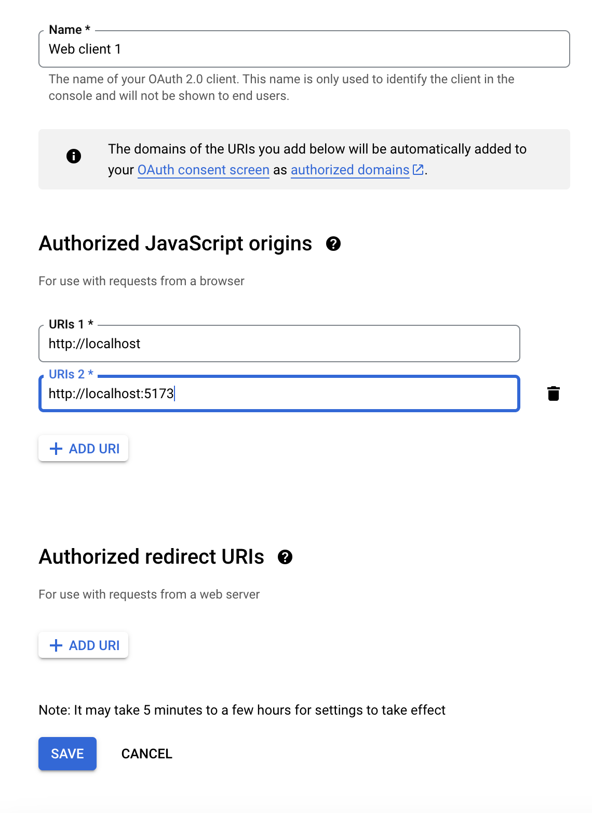

  - Now, please add some `Authorized redirect URIs`. This will depend on what page do you depend to use the CapacitorSocialLogin plugin on. In my case, I am going to be using it on `http://localhost:5173/auth` 
    
    - Please click on `ADD URI`
      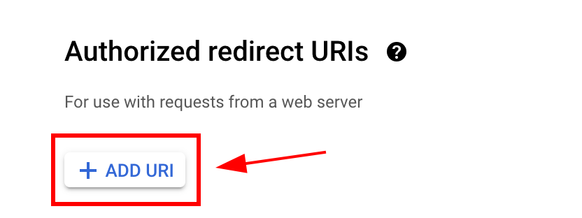
    
    - Enter your URL and click `ADD URL` again
      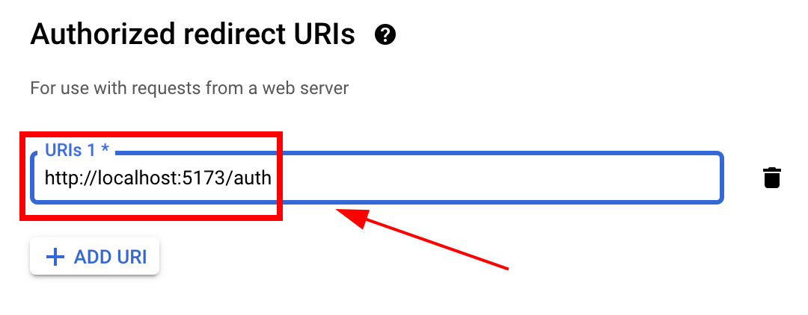

  - Click `save`
    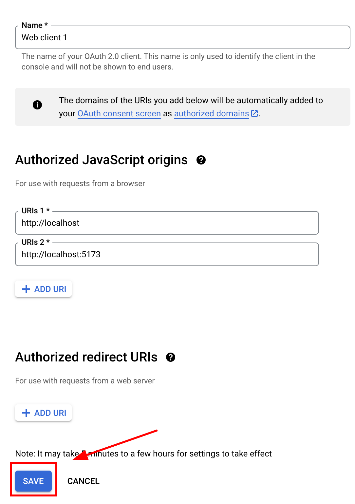
3. Now, you should be ready to call `login` from JavaScript like so:
- First, you need import `SocialLogin`
  
  ```typescript
  import { ScialLogin } from '@capgo/capacitor-social-login';
  ```

- Then, you want to call initialize. I recommend calling this ONLY once.
  
  ```ts
  // onMounted is Vue specific
  // webClientId is the client ID you got in the web client creation step not the android client ID.
  onMounted(() => {
   SocialLogin.initialize({
     google: {
       webClientId: '673324426943-avl4v9ubdas7a0u7igf7in03pdj1dkmg.apps.googleusercontent.com',
     }
   })
  })
  ```
  
  Later, you want to call `SocialLogin.login`. I recommend creating a button and running the following code on click.
  
  ```ts
  const res = await SocialLogin.login({
   provider: 'google',
   options: {}
  })
  // handle the response. popoutStore is specific to my app
  popoutStore.popout("Google login", JSON.stringify(response))
  ```

### Differences between online access and offline access

|                         | Online access | Offline access |
|:-----------------------:|:-------------:|:--------------:|
| Requires a backend      | ❌             | ✅              |
| Long-lived access token | ❌             | ✅              |
| Easy setup              | ✅             | ❌              |

📝 Long lived access tokens allow the backend to call Google API's even when the user is not present

If you still do not know which one you should choose, please consider the following scenarios:

1. You want the user to login, immediately after you are going to issue him a custom JWT. Your app will NOT call Google APIs
   
   In this case, choose online access.

2. Your app will call some Google APIs from the client, but never from the backend
   
   In this case, choose online access

3. Your app will call some google APIs from the backend, but only when the user is actively using the app
   
   In this case, choose online access

4. Your app will periodically check the user's calendar, even when he is not actively using the app
   
   In this case, choose offline access

### An example backend for online access

In this part of the tutorial, I will show how to validate the user on your backend. 

This example will be very simple and it will be based on the following technologies:

- [Typescript](https://www.typescriptlang.org/)

- [Hono](https://hono.dev/)

- [Javascript's fetch API](https://developer.mozilla.org/en-US/docs/Web/API/Window/fetch)

You can find the code for this example [here](https://github.com/WcaleNieWolny/capgo-social-login-backend-demo/blob/141c01d93a85240e31a0d488a89df13c842708b1/index.ts#L135-L153)

As you can see:

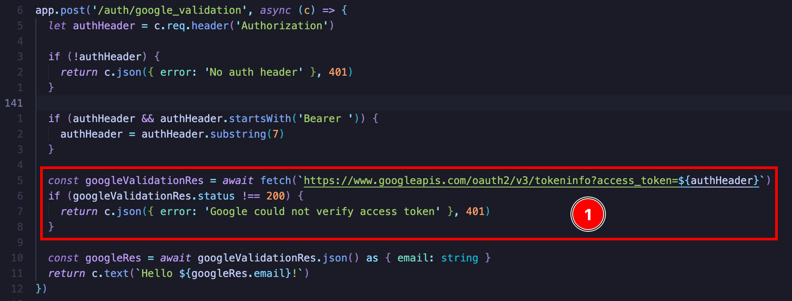

The idea is rather simple. You send a simple `GET` request to `https://www.googleapis.com/oauth2/v3/tokeninfo` and this returns you whether the token is valid or not and if it it is, it gives you the email of the user. It also gives you some other info about the user token
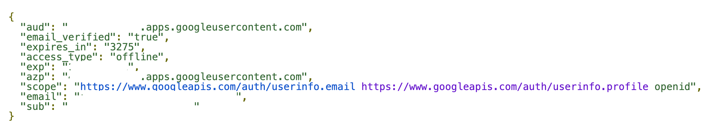

For there, you could issue the user with your own JWT or issue some sort of session cookie. The possibilities are endless, for the final auth implementation.

If you do want to call Google API's, I would strongly recommend at [Google's OAuth 2.0 Playground](https://developers.google.com/oauthplayground). From there you can easily see what APIs you can call.

### Using online access with your own backend

In order to use online access you will need the following:

- An HTTP server

In this example, I will be using the following technologies to provide the offline access in my app:

- [Hono](https://hono.dev/)

- [Hono Zod validator](https://hono.dev/docs/guides/validation#with-zod)

- [Zod](https://zod.dev/)

- [Hono JWT](https://hono.dev/docs/helpers/jwt#jwt-authentication-helper)

- [LowDb](https://www.npmjs.com/package/lowdb) (a simple database)

The code for this example can be found [here](https://github.com/WcaleNieWolny/capgo-social-login-backend-demo/blob/aac7a8c909f650a8c2cd7f88c97f5f3c594ce9ba/index.ts#L139-L287)

As for the client code, it looks like this:

```ts
import { Capacitor } from '@capacitor/core';
import { GoogleLoginOfflineResponse, SocialLogin } from '@capgo/capacitor-social-login';
import { usePopoutStore } from '@/popoutStore'; // <-- specific to my app

const baseURL = "[redacted]";

async function fullLogin() {
  await SocialLogin.initialize({
    google: {
      webClientId: '[redacted]',  
      iOSClientId: '[redacted]',
      iOSServerClientId: 'The same value as webClientId',
      mode: 'offline' // <-- important
    } 
  })
  const response = await SocialLogin.login({
    provider: 'google',
    options: {
      forceRefreshToken: true // <-- important
    }
  })

  if (response.provider === 'google') {
    const result = response.result as GoogleLoginOfflineResponse
    const res = await fetch(`${baseURL}/auth/google_offline`, {
      headers: {
        "Content-Type": "application/json"
      },
      body: JSON.stringify({
        serverAuthCode: result.serverAuthCode,
        platform: Capacitor.getPlatform()
      }),
      method: "POST"
    })

    if (res.status !== 200) {
      popoutStore.popout("Full google login failed", "check console");
      return
    }

    const { jwt } = await res.json();
    const userinfo = await fetch(`${baseURL}/auth/get_google_user`, {
      headers: {
        Authorization: `Bearer ${jwt}`
      }
    })
    if (userinfo.status !== 200) {
      popoutStore.popout("Full google (userinfo) login failed", "check console");
      return
    }
    popoutStore.popout("userinfo res", await userinfo.text());
  }
}
```
